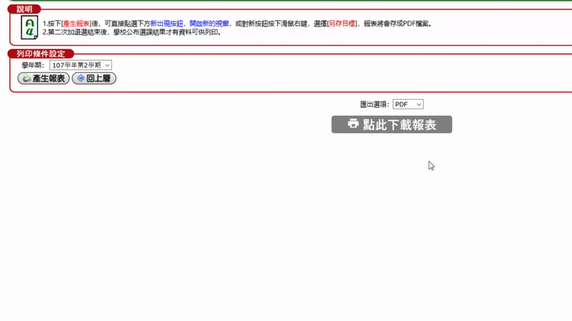
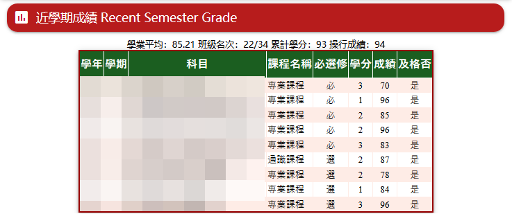

# nptu-redux

> 請注意！本插件仍在早期設計階段中，若有任何問題，請將其插件關閉並回報於 Issues 中。

一套為了改進某學校系統介面及使用性而寫的 GreaseMonkey 插件。

## 安裝

1. 依照您的瀏覽器安裝 ViolentMonkey 或 TamperMonkey
    * [Chrome](https://chrome.google.com/webstore/detail/violentmonkey/jinjaccalgkegednnccohejagnlnfdag)
    * [Firefox](https://addons.mozilla.org/en-US/firefox/addon/violentmonkey/)
2. [點此安裝 NPTU-Redux](https://github.com/mt-hack/nptu-redux/raw/master/nptu-redux.user.js)
3. 大功告成！享受新版平台吧！

## 功能

* 以 Google 的 [Material Design](https://material.io) 設計為基底，改造整體頁面整齊性
* 支援學生/教職員用戶端 (推廣教育及校友資訊尚未測試)
* 支援 i-net 報表各項匯出功能 (不必再安裝 Java 然後再去開IE啦！)

### 學生端功能

* 首頁新增「近學期成績」

### 教職員端功能

* Coming soon!

## 已知問題

* Microsoft Edge (非 Chromium 版) 無法正常顯示部分 Material Icons
* CSS 需 fallback 支援 (如 404 或MIME type mismatch 時應用舊版)
* 目前 Javascript 急需整理
